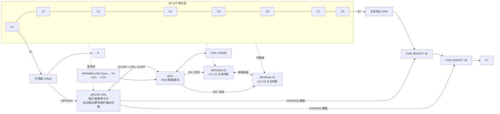

> ⚠ **v0.3（2026-09-26）起主动均衡改为 MP2643 ×7**，本文中 MP2645A 相关内容已被 `03-详细设计.md` 第 4 节取代。

# 8S LiFePO4 200A BMS 系统设计说明（MPS 方案）

> 版本 v0.1 · 2026-09-26 · 状态：方案设计（原理图前）
>
> 标注 **【待核】** 的条目依据的是 MPS 公开的产品简介，未拿到完整数据手册；
> 画原理图前必须对照 MP2797 / MP2645A 正式 Datasheet 逐项确认。

---

## 1. 需求与设计假设

| 项目 | 取值 | 备注 |
|---|---|---|
| 电芯 | LiFePO4 (LFP)，8 串 | 假设 200Ah 方形电芯（1C = 200A） |
| 电压 | 标称 25.6V，范围 20.0 ~ 29.2V | 2.50 ~ 3.65V/节 |
| 最大持续放电 | **200A** | 软件 OCD1 = 220A/10s |
| 最大持续充电 | 100A（0.5C） | 同口方案，充放电共用 P+/P- |
| 峰值 / 短路 | OCD 硬件 400A/10ms，SCP 800A/200µs | 在 MP2797 寄存器中配置 |
| 均衡 | **自动主动均衡**（MP2645A，A 级电流）+ 被动微调（MP2797 内部 58mA） | |
| 温度 | 充电 0~55°C，放电 -20~65°C | LFP 0°C 以下禁止充电 |
| 通讯 | CAN 2.0B + RS485（可选）+ 调试 UART | |

## 2. 系统架构



**分工原则**

- **MP2797（AFE）**：一切"快"的、与安全强相关的事都在硬件里完成 —— SCP、OCD、
  OV/UV 硬件阈值、MOSFET 驱动与软启动。MCU 死机也不能失去短路保护。
- **MP2645A × 2（主动均衡）**：电感式双向 buck-boost 电荷搬移，自主运行；MCU 只通过
  EN 决定"何时允许均衡"。
- **MCU**：二级保护、均衡使能策略、SOC/SOH、通讯、日志。

## 3. 芯片选型

| 位号 | 器件 | 作用 | 关键参数（公开资料） |
|---|---|---|---|
| U1 | **MPS MP2797** | 电池监测与保护 AFE | 7~16 串（8S 在范围内）；双 ADC（电芯电压 + 库仑计）；4 路 NTC + 片温；高边 NMOS 驱动，DSG 可配置软启动；OCP/SCP/OVP/UVP/OTP；I2C 或 SPI 带 CRC；内部被动均衡最大 58mA，也可驱动外部均衡管；TQFP-48 |
| U2, U3 | **MPS MP2645A** | 5 节主动均衡器 | 双向 buck-boost 电感式；单颗 5 节；单线级联接口，最多 8 颗；支持 LFP；MP2645 最大 3.75A 均衡电流【A 版参数待核，目前为 pre-release】 |
| U4 | MPS MP9486A | 辅助电源 Buck | 100V 输入，pack→5V【型号待核】 |
| U5 | 3.3V LDO（如 MPS MP2013A） | MCU/AFE 数字电源 | 低 Iq【型号待核】 |
| U6 | MCU（STM32G0B1 / GD32 等，带 FDCAN） | 主控 | MPS 无通用 MCU，选第三方 |
| Q1~Q16 | 80V N-MOSFET，≤1.2mΩ，TOLL（如 Infineon IPT012N08N5） | 充/放电开关 | 每方向 8 并联 |

> 仓库名 MP2645A 即主动均衡芯片。由于它是 5 节器件，8S 需要 **2 颗级联**。

## 4. 功率回路设计（200A）

### 4.1 拓扑

- **高边、背靠背共源**：B+ → 保险丝 → CHG 组 → DSG 组 → P+。MP2797 为高边驱动，
  B-/P- 共地，通讯（CAN/RS485）无需隔离，这是 200A 级储能/低速车包的主流做法。
- **每方向 8 颗并联**（共 16 颗）。计算（`python3 tools/bms_calc.py`）：

| 工况 | 通路电阻(热态) | 通路损耗 | 最坏单管 Tj（环境 45°C） |
|---|---|---|---|
| 放电 200A | 0.51 mΩ | 20.4 W | 78.7°C |
| 充电 100A | 0.51 mΩ | 5.1 W | 53.4°C |

  假设：Rds(on) 1.2mΩ×1.7（热态），均流偏差 15%，装铝散热器后单管等效 Rθja 20 K/W。
  20W 的热量必须靠 **铝基散热器 + 导热垫** 导出，不能只靠 PCB 铜皮。

### 4.2 MOSFET 驱动

- 每颗 MOSFET 独立栅极电阻 **10Ω**，G-S 并 **100kΩ + 15V 稳压管**。
- 8 颗并联总 Qg ≈ 1.42µC。MP2797 片内驱动的下拉能力有限【待核】，**DSG 组加 PNP
  快速关断电路**（每组一个 PNP，发射极接栅极总线，集电极接源极），保证短路时
  µs 级关断、MOSFET 不进入线性区。1A 下拉时关断约 1.4µs。
- 大容性负载（逆变器）用 MP2797 的 DSG **软启动**功能限制浪涌，可省掉预充电阻；
  若负载电容 > 10mF，建议另加 PMOS + 功率电阻预充支路。

### 4.3 浪涌与保险

- P+/P- 间 **TVS：SMDJ33A ×2 并联**（关断电压 33V > 29.2V，钳位 ≈ 53V < 80V）。
- P+/P- 间 **10 × 1µF/100V X7R** 就近放置在 MOSFET 旁，吸收关断尖峰。
- B+ 串 **300A 熔断器**（ANL/MEGA），作为 BMS 失效的最终保护。

### 4.4 大电流走线

- 功率通路用 **铜排**（≥ 40mm² 截面，如 20×2mm 紫铜）焊接或螺栓固定在 PCB 上，
  PCB 本身 4oz 铜厚仅用于分流和散热，不作为主载流导体。
- 端子：M8 螺柱，线缆 ≥ 50mm²。

## 5. 电流采样

- **低边分流器 100µΩ**（锰铜，4 端子开尔文，额定 ≥ 10W，如 Isabellenhütte BVR 系列）。
- 200A → 20mV，功耗 4W；800A SCP → 80mV。1µV 对应 10mA，库仑计分辨率足够。
- SRP/SRN 走 **差分对**，从分流器开尔文端子直接引出，各串 **100Ω**，
  跨接 **0.1µF**（差模）+ 各对地 **0.01µF**（共模）【以手册推荐值为准】。
- SCP/OCD 硬件阈值按 100µΩ 换算写入 MP2797 寄存器，量产时做 **零偏 + 增益校准**，
  系数存 MCU Flash。

## 6. MP2797 AFE 连接

| 功能 | 连接 | 说明 |
|---|---|---|
| 电芯采样 | VC0~VC8 各串 **100Ω**，对地/对相邻节 **0.1µF** | 8S 使用 7~16 串器件时，**未用通道按手册要求短接到最高节**【待核具体方法】 |
| 温度 | NTC1/2：电芯表面（中间与边缘各一），NTC3：MOSFET 散热器，NTC4：分流器 | 10kΩ B3435，分压上拉按手册 |
| 驱动 | CHG/DSG 高边驱动 → MOSFET 栅极总线；PACK 检测脚 → P+ | 用于负载/充电器检测 |
| 通讯 | I2C（或 SPI）**开启 CRC**；ALERT 中断 → MCU EXTI | 保护事件立即通知 MCU |
| 被动均衡 | 使用内部 58mA MOSFET | 均衡电阻按手册；仅用于顶部 mV 级微调 |

## 7. 主动均衡设计（MP2645A × 2）

### 7.1 连接方案

MP2645A 是 5 节器件，级联时相邻两颗 **共用一节电芯**（8 颗 → 33 节 = 8×4+1 印证了
这一点）。8S 两种接法：

- **方案 A（推荐，待手册确认）**：U2 接 C1~C5，U3 接 C4~C8，两颗都工作在满 5 节配置，
  C4、C5 为重叠节，电荷可在两组之间传递。
- **方案 B**：U2 接 C1~C5，U3 接 C5~C8 按 4 节配置（若手册支持少节数/空通道短接）。

两颗之间走 **单线级联接口**，最低一颗（U2）的 EN 由 MCU 控制；MCU 通过读取级联
状态/故障脚监控均衡器【接口细节待核】。

### 7.2 外围

- 功率电感：按手册推荐值（此类器件典型 4.7~10µH），**饱和电流 ≥ 1.5 × 均衡峰值电流**，
  屏蔽式，低 DCR。
- 均衡线与采样线 **分开走线、分开接到电芯端子**：3A 均衡电流在采样线上会造成几十 mV
  压降，导致 AFE 读数错误。若只能共线，MCU 在测电压时先暂停均衡（EN 拉低 ≥ 10ms）。
- 设计均衡电流取 **3A**（器件上限 3.75A，留热裕量），每颗芯片附近铺铜散热 + NTC 区域。

### 7.3 效果

| 场景（200Ah 电芯，5% SOC 偏差 = 10Ah） | 时间 |
|---|---|
| MP2645A 主动均衡 3A、效率 85% | **≈ 3.9 h** |
| 仅被动 50mA | ≈ 200 h |

主动均衡把多余电量搬给低电芯而不是烧成热，适合 200Ah 这种大容量包——被动均衡
对 200Ah 电芯基本无能为力。

## 8. 保护参数

| 保护 | 触发 | 延时 | 恢复 | 执行者 |
|---|---|---|---|---|
| 单体过压 | ≥ 3.65V | 1s | ≤ 3.40V | MP2797 硬件 + MCU |
| 单体欠压 | ≤ 2.50V | 1s | ≥ 2.90V | MP2797 硬件 + MCU |
| 放电过流 1 | ≥ 220A | 10s | 30s 后自动重试 | MCU |
| 放电过流 2 | ≥ 300A | 1s | 30s 后自动重试 | MCU |
| 放电过流 3 | ≥ 400A | 10ms | 负载移除 | MP2797 硬件 |
| 短路 | ≥ 800A | 200µs | 负载移除后 1s | MP2797 硬件 |
| 充电过流 | ≥ 110A | 3s | 30s 后自动重试 | MCU |
| 充电高/低温 | ≥ 55°C / ≤ 0°C | 2s | ≤ 50°C / ≥ 5°C | MCU |
| 放电高/低温 | ≥ 65°C / ≤ -20°C | 2s | ≤ 55°C / ≥ -15°C | MCU |
| MOSFET 过温 | ≥ 100°C | 2s | ≤ 80°C | MCU |
| 压差告警 | ≥ 300mV | — | — | MCU（仅告警） |

**体二极管保护**：过压时禁止充电，但若检测到放电电流（≥ 2A）则临时打开 CHG 管；
欠压时同理。否则 200A 走体二极管会在几秒内烧毁 MOSFET。

所有参数集中在 `firmware/src/bms_config.h`。

## 9. 均衡策略（针对 LFP 的关键点）

LFP 在 10%~90% SOC 的 OCV 平台非常平（3.28~3.33V），**平台区的电压差不代表 SOC 差**，
按电压均衡会越均越乱。因此：

1. **顶部均衡（主策略）**：最高节 ≥ 3.40V 且压差 ≥ 30mV → 使能 MP2645A；
   压差 ≤ 10mV 停止；最高节回落到 3.35V 以下退出。
2. **静置均衡**：|I| < 2A 持续 30min（极化消除），压差 ≥ 80mV 才启动；一有电流立即退出。
3. **被动微调**：主动均衡停止后、处于顶部区，高于最低节 5mV 的电芯由 MP2797 内部
   58mA 放电（相邻节不同时开）。
4. **禁止条件**：电芯温度 < 0°C 或 > 50°C，或存在除过压外的任何故障。
5. **进阶（可选）**：基于每节 SOC（库仑计 + 满充校准）计算容量差，在满充点前提前
   启动均衡。

逻辑实现：`firmware/src/bms_logic.c`，15 个主机端单元测试覆盖上述行为。

## 10. 电源与低功耗

```
PACK(20~29.2V) ── MP9486A Buck ── 5V ──┬── CAN 收发器
                                        └── LDO ── 3.3V ── MCU / AFE 数字 IO
```

- 运行模式：MCU 全速、AFE 连续采样。
- 休眠：MCU STOP 模式，AFE 低功耗周期采样，**MP2645A EN 拉低**；
  唤醒源：AFE ALERT（充电器/负载接入、电流阈值）、CAN 唤醒、按键。
- 目标休眠电流 < 300µA（200Ah 包一年自耗 < 3Ah）。
- 深度关机（运输模式）：MCU 命令 AFE 进入 Ship 模式，充电器接入唤醒【待核】。

## 11. 通讯

- **CAN 2.0B 500kbps**（如 TJA1051，非隔离，共地），支持 SOC/电压/温度/告警上报，
  可按逆变器协议（Pylontech 等）适配。
- RS485（可选）+ 调试 UART。
- 全部外部接口加 ESD（如 PESD2CAN），CAN 线 120Ω 终端可跳线选择。

## 12. PCB 布局要点

1. **功率区与信号区物理分开**，功率地（分流器 P- 侧）与信号地在 **分流器 B- 开尔文点单点连接**。
2. 采样线从电芯端子独立引出，AFE 输入 RC 紧靠芯片。
3. SRP/SRN 差分对紧耦合、远离 MOSFET 开关节点。
4. MOSFET 对称排布、栅极走线等长，保证均流；源极回路面积最小。
5. MP2645A 电感环路最小，远离 AFE 采样走线，底层整面地屏蔽。
6. 4 层板，外层 4oz，内层 2oz；功率 MOSFET 背面 TOLL 焊盘通过过孔阵列连到散热面。

## 13. 固件架构

```
main loop (100ms tick)
 ├─ afe_read()        MP2797: 8 节电压、电流、4 路 NTC、状态寄存器（CRC 校验）
 ├─ bms_step()        保护状态机 + 均衡决策（纯逻辑，可单测）
 ├─ afe_apply()       CHG/DSG 使能、被动均衡位图
 ├─ bal_apply()       MP2645A EN
 ├─ soc_update()      库仑积分 + 满充/静置 OCV 校准
 └─ comm_task()       CAN / RS485
ISR: AFE ALERT → 立即读取故障寄存器并同步状态
```

- MP2797 的寄存器驱动需依据正式手册编写（本仓库只提供与硬件无关的逻辑层）。
- 看门狗：MCU 独立看门狗 + AFE 通讯超时，超时由 AFE 自行关断 MOSFET【待核是否支持】。

## 14. 验证计划

| 阶段 | 内容 |
|---|---|
| 软件 | `make -C firmware test`、`python3 -m unittest discover -s tests` |
| 板级 | 采样精度（±5mV 目标）、电流校准、各保护阈值与延时 |
| 功率 | 200A 持续 2h 温升；400A/10ms、短路（≥ 2kA 电源）关断波形，Vds 尖峰 < 64V（80% 额定） |
| 均衡 | 人为制造 5% SOC 偏差，记录 MP2645A 实际均衡电流、效率与收敛时间 |
| 环境 | 高低温、振动、EMC（ESD ±8kV 接触） |

## 15. 风险与待确认

1. **MP2645A 为 pre-release**，最大均衡电流、4 节配置、级联接口细节需拿正式手册确认；
   可向 MPS 代理申请样品与 EVB。
2. MP2797 高边驱动能否直接驱动 8 并联 MOSFET 的开通速度与电荷泵能力需核对；
   不足时加外部栅极驱动（如自举/隔离驱动）。
3. 8S 在 MP2797 的 7~16 串范围内，但未用通道的处理方式以手册为准。
4. 200Ah 电芯为假设值，若电芯容量不同，用 `tools/bms_calc.py` 改参数重新复核。
